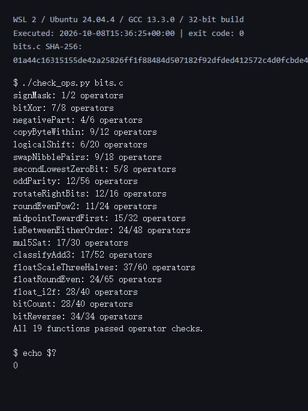
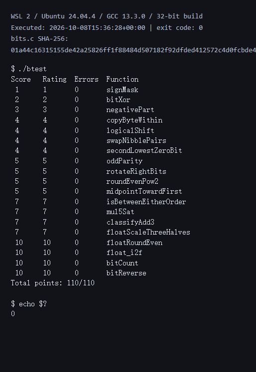

# Lab 1 实验报告：Data Lab

- 姓名：卢伟
- 学号：23300130024
- 实验日期：2026 年 10 月 8 日
- 个人仓库：[qwertyuiop315/ICS2026-DataLab](https://github.com/qwertyuiop315/ICS2026-DataLab)

## 1. 实验目标与环境

本实验完成 P1–P19 的位运算函数，练习补码、掩码、移位、溢出判断和 IEEE 754 单精度舍入。整数题按照课程的 32 位位向量模型计算，只使用各题允许的运算符、`int` 局部变量和 0–255 的常量；浮点题只操作整数编码，不使用浮点类型、转换或函数调用。

环境为 Windows 上的 WSL 2、Ubuntu 24.04.4 LTS（x86-64）、GCC 13.3.0、GNU Make 4.3。已安装 `gcc-multilib` 和 `libc6-dev-i386`。本地使用原 Makefile 的 `-O -Wall -fwrapv -m32` 参数；GitHub Actions 使用模板内预设的参数。

原有代码文件只修改 `bits.c` 的 19 个函数体，函数签名、题目注释、头文件、测试程序、Makefile、规则检查器、评分脚本和 workflow 均保持模板内容。报告和 `assets/` 为新增材料。

## 2. 实验步骤与测试结果

通过课程提供的 DataLab 模板创建个人仓库，完成函数后在仓库目录执行：

```bash
make clean
make all
./check_ops.py bits.c
./btest
./test.sh
```

构建成功，规则检查输出 `All 19 functions passed operator checks.`，19 道题的 `Errors` 均为 0，完整测试输出 `Total points: 110/110`，原 `test.sh` 返回 0。

以下图片是实际 WSL 命令输出的浏览器终端视图截图，附有执行时间、退出码与所测源码的 SHA-256；原始输出也一并保存。图片通过相对路径引用，随报告提交。



[规则检查原始输出](assets/check_ops.txt)



[btest 原始输出](assets/btest.txt)

| 题号 | 函数 | 操作数 / 上限 | 得分 |
| --- | --- | --- | --- |
| P1 | `signMask` | 1 / 2 | 1 / 1 |
| P2 | `bitXor` | 7 / 8 | 2 / 2 |
| P3 | `negativePart` | 4 / 6 | 3 / 3 |
| P4 | `copyByteWithin` | 9 / 12 | 4 / 4 |
| P5 | `logicalShift` | 6 / 20 | 4 / 4 |
| P6 | `swapNibblePairs` | 9 / 18 | 4 / 4 |
| P7 | `secondLowestZeroBit` | 5 / 8 | 4 / 4 |
| P8 | `oddParity` | 12 / 56 | 5 / 5 |
| P9 | `rotateRightBits` | 12 / 16 | 5 / 5 |
| P10 | `roundEvenPow2` | 11 / 24 | 5 / 5 |
| P11 | `midpointTowardFirst` | 15 / 32 | 5 / 5 |
| P12 | `isBetweenEitherOrder` | 24 / 48 | 7 / 7 |
| P13 | `mul5Sat` | 17 / 30 | 7 / 7 |
| P14 | `classifyAdd3` | 17 / 52 | 7 / 7 |
| P15 | `floatScaleThreeHalves` | 37 / 60 | 7 / 7 |
| P16 | `floatRoundEven` | 24 / 65 | 10 / 10 |
| P17 | `float_i2f` | 28 / 40 | 10 / 10 |
| P18 | `bitCount` | 28 / 40 | 10 / 10 |
| P19 | `bitReverse` | 34 / 34 | 10 / 10 |
| 合计 | 19 题全部通过 | 各题均符合限制 | **110 / 110** |

### 补充验证

在原评分程序之外进行了两项额外验证，未更改评分程序或评分权重：

1. 使用 pycparser 读取实际整数函数体，转换为 Z3 的 32 位位向量表达式，与独立的规格表达式比较。16 个整数函数均得到 `unsat`，证明在全部合法输入下不存在输出不一致或移位量超出 0–31 的情况。数学和、平均值、饱和乘法等参考规格使用 64 位表达式，避免参考计算自身溢出。[验证记录](assets/integer-proof.txt)
2. 使用独立遍历程序，将三个浮点函数分别与未修改的 `tests.c` 参考函数比较。每个函数覆盖全部 4,294,967,296 个输入，共 12,884,901,888 次比较，结果全部一致；舍入模式设为 `FE_TONEAREST`。[验证记录](assets/exhaustive-float.txt)

## 3. 逐题实现思路

### P1：signMask

将常量 1 左移 31 位，得到只有最高位为 1 的 `0x80000000`。这依赖课程允许的 32 位位向量左移模型。

### P2：bitXor

异或的结果在两个输入位不同时为 1。表达式 `~(x & y) & ~(~x & ~y)` 同时排除了“两位都是 1”和“两位都是 0”，因此只使用 `~`、`&` 就能实现异或。

### P3：negativePart

`x >> 31` 在负数时产生全 1 掩码，在非负数时产生全 0 掩码。将它与补码取负表达式 `~x + 1` 相与，选出负数的取负结果。`INT_MIN` 按课程位向量模型保留低 32 位。

### P4：copyByteWithin

用 `src << 3` 和 `dst << 3` 得到字节的位移。先右移并与 255 相与提取源字节，再清除目标字节并写入源字节。源、目标相同时结果不变，写入最高字节也能正确保留其它字节。

### P5：logicalShift

先算术右移，再用 `~(((1 << 31) >> n) << 1)` 构造低 `32-n` 位为 1 的掩码，去掉右移补入的符号位。当 `n=0` 时掩码是全 1，当 `n=31` 时掩码只有最低位为 1；所有移位量都在允许范围内。

### P6：swapNibblePairs

从 15 构造 `0x0f0f0f0f`，选出各字节的低半字节左移 4 位，另将高半字节右移 4 位后掩码保留。两部分按位或即可交换每个字节内部的两个半字节。

### P7：secondLowestZeroBit

`x | (x + 1)` 把最低的 0 位设置为 1。对所得 `filled` 计算 `~filled & (filled + 1)`，隔离其最低的 0 位，即原数的第二个 0 位。不足两个 0 位时返回 0；`x=0` 时返回 2。

### P8：oddParity

依次将右移 16、8、4、2、1 位的结果与自身异或，将所有位的异或结果折叠到最低位。题目要求原数的 1 位个数为偶数时返回 1，所以最后对最低位取逻辑非；例如 5 返回 1，7 返回 0。

### P9：rotateRightBits

先通过 `n & 31` 将位数对 32 取模。右侧部分使用逻辑右移掩码，左侧部分左移 `(~n + 1) & 31` 位，再合并。后一位数也对 32 取模，因此 `n=0` 和 32 的倍数不会产生移位 32 位的问题。

### P10：roundEvenPow2

取下方倍数的商的奇偶位 `quotientOdd`，加上偏置 `2^(n-1)-1+quotientOdd`，再右移、左移清除低 `n` 位。余数正好为半程时，偶商采用较小偏置而向下舍入，奇商采用较大偏置而向上舍入，最终商为偶数。

### P11：midpointTowardFirst

利用恒等式 `(x & y) + ((x ^ y) >> 1)` 得到精确中点向下取整的值，避免直接计算 `x+y` 导致溢出。若和为奇数且 `x>y`，加 1，使结果更靠近第一个参数。比较时，异号输入根据符号位判断，同号输入才使用差值的符号，避免减法溢出误判。

### P12：isBetweenEitherOrder

分别判断 `x<a` 和 `x<b`。异号时使用 `x` 的符号，同号时使用 `x-a` 或 `x-b` 的符号。两个严格比较结果不同时，`x` 位于两端点之间；再补上 `x=a` 和 `x=b` 的情况，形成含端点、与端点顺序无关的区间判断。

### P13：mul5Sat

依次得到 `2x`、`4x`、`5x`，检查每步与前一步的符号是否变化。对于非零同号增长，任何一步符号变化都表示数学上的 `5x` 已超出范围。把溢出位扩展为掩码，选择按原数符号决定的 `INT_MAX` 或 `INT_MIN`；未溢出时选择 `5x`。

### P14：classifyAdd3

先计算低 32 位的 `x+y`，再加 `z`。每次用 `((a ^ sum) & (b ^ sum)) >> 31` 检查两个同号加数是否得到异号结果。正向溢出对应数学结果比带符号低 32 位结果多 `2^32`，记作 +1；负向溢出记作 -1。将两次修正相加即可得到分类，两个方向相反的中间溢出会相消。例如 `INT_MAX+INT_MAX+INT_MIN` 最终仍在范围内，应返回 0。

### P15：floatScaleThreeHalves

拆分符号、阶码和尾数。NaN 和无穷直接返回输入。非规格化数将尾数乘 3 后右移 1 位，依据丢弃位和保留位的奇偶性进行最近偶数舍入；结果也可能自然进入最小规格化数区间。

规格化数补回隐藏的最高有效位后乘 3，根据乘积的最高位右移 1 位或 2 位，并相应调整阶码。用余数与半程比较，半程相等时只对奇数有效数加 1；必要时处理舍入进位和阶码溢出。符号单独保留，所以负零仍返回负零。最小非规格化数乘 1.5 后处于中点，应舍入为编码 2。

### P16：floatRoundEven

单精度的阶码至少为 150 时已无小数位，直接返回，包括 NaN 和无穷。绝对值小于 0.5 时返回带原符号的零；恰好 0.5 舍入为偶数零，大于 0.5 且小于 1 时返回带符号的 1。

其它数根据阶码求出小数位数，清除这些位并计算余数。大于半程时加一个整数单位，等于半程且保留的整数部分为奇数时也加一个单位。有效数进位可直接进入阶码。例如 1.5 变为 2、2.5 变为 2、-0.5 变为负零。

### P17：float_i2f

在 `unsigned` 中取得整数幅值，使 `INT_MIN` 的幅值 `0x80000000` 可表示。定位最高的 1 位，据此确定阶码。幅值不超过 24 个有效位时精确左移对齐，否则保留最高 24 位，根据剩余部分进行最近偶数舍入。

打包时把包含隐藏位的有效数加到预先减去一阶的阶码编码上，既恢复正常阶码，也自然处理舍入进位。例如 `INT_MAX` 舍入为 `2^31` 的单精度编码，`INT_MIN` 则精确表示。

### P18：bitCount

使用并行分组统计：先统计每 2 位，再每 4 位，再每字节，最后把各字节和半字相加。每一步用掩码隔离组间影响，最后与 63 相与提取 0–32 的计数。

### P19：bitReverse

按 1、2、4、8、16 位组逐层交换，实现整段 32 位反转。从 `0x00ff00ff` 出发，分别与自身左移 4、2、1 位的结果异或，依次构造 `0x0f0f0f0f`、`0x33333333`、`0x55555555`。这样复用掩码结构，把操作数控制在 34 次。右移部分及时与对应掩码相与，防止算术右移的符号扩展影响结果。

## 4. 体会与参考资料

这次实验中，符号位判断和中点舍入需要特别注意。只看最终结果的符号不足以发现所有溢出，必须分析中间运算或使用可证明的修正；浮点舍入则必须把“恰好半程且保留位为奇数”与其它情况分开。规则检查、功能测试和补充验证分别覆盖写法合法性、参考行为一致性与完整输入范围。

参考与辅助工具如下：

1. [课程 Lab1 实验说明](https://ics-26fall-fdu.github.io/labs/lab1-data-lab/)：题目背景、报告和提交要求。
2. [官方 DataLab 模板](https://github.com/ICS-26Fall-FDU/DataLab)：`README.md`、`bits.c` 题目注释、`decl.c` 输入范围以及未修改的 `tests.c` 参考行为。
3. OpenAI Codex：辅助推导、编写实现、检查边界及整理报告。实现根据本次题意推导，未检索或复制其他同学的实现。
4. GCC、pycparser、Z3：分别用于实际编译、读取整数函数语法树和补充位向量验证；三个浮点函数另由 C 遍历程序逐输入对照原参考函数。
